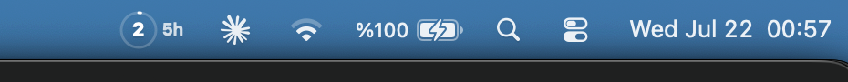
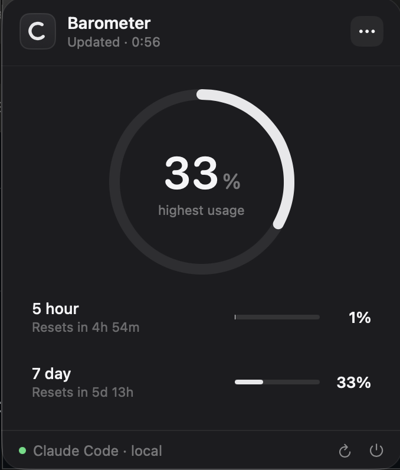

# Barometer — Claude Code Usage Monitor for macOS

**A private macOS menu bar app for your Claude Code usage limits. Nothing else.**

[](LICENSE)
[](#requirements)
[](https://github.com/YasinSimsek99/barometer/actions/workflows/ci.yml)

Barometer puts your Claude Code 5-hour and 7-day rate-limit usage and reset countdowns in the macOS menu bar — no dashboard, no browser tab, just a glance.

It reads only `rate_limits.five_hour` and `rate_limits.seven_day` from Claude Code's local status-line output. Everything else — credentials, OAuth tokens, cookies, API keys, prompts, transcripts, model details, context usage, token counts, cost, working directory — is discarded before it reaches the app. **No background network requests. No analytics. No telemetry.** The only network call Barometer ever makes is "Check for Updates" against GitHub's public releases API — triggered on demand, or automatically once a day if the user opts in — see [PRIVACY.md](PRIVACY.md).

Left-click the menu bar icon for the usage panel. Right-click for quick access to refresh, display style, notifications, launch at login, and settings.

<p>
  <br>
  
</p>

## Requirements

- macOS 14 Sonoma or later
- Claude Code with a Claude.ai Pro or Max subscription

Claude Code only reports `rate_limits` after its first API response in a session — Barometer shows "No usage data yet" until then.

## Install

```bash
brew install --cask YasinSimsek99/tap/barometer
```

or grab the signed, notarized `.dmg` or `.zip` straight from the [Releases page](https://github.com/YasinSimsek99/barometer/releases) — no local build tooling required.

For a scripted install with checksum + notarization verification:

```bash
curl -fsSL https://github.com/YasinSimsek99/barometer/releases/download/v1.0.0/install-v1.0.0.sh | bash
```

Prefer to inspect the script first:

```bash
curl -fsSLO https://github.com/YasinSimsek99/barometer/releases/download/v1.0.0/install-v1.0.0.sh
less install-v1.0.0.sh
bash install-v1.0.0.sh
```

Every route installs to `~/Applications/Barometer.app`. None use `sudo`.

## Build from source

```bash
git clone https://github.com/YasinSimsek99/barometer.git
cd barometer
make test
make install
```

Requires Xcode, not just Command Line Tools (`swift test` needs Xcode's XCTest). This produces an ad-hoc-signed local build. For development: `swift run BarometerApp`.

## How the Claude Code connection works

Barometer swaps in a local helper, `barometer-bridge`, as your Claude Code `statusLine`. It allowlists only the two usage percentages, chains your previous status-line command so nothing breaks, and writes a `0600` local cache the menu bar reads — nothing else survives the trip.

```text
Claude Code stdin JSON → barometer-bridge → previous status-line command → Claude Code UI
                                │
                                └─ sanitized percentages + reset times → local 0600 cache → menu bar
```

Disconnecting restores your original status line exactly. See [PRIVACY.md](PRIVACY.md) and [THREAT_MODEL.md](THREAT_MODEL.md) for the full data boundary.

## Uninstall

```bash
make uninstall                     # source checkout
brew uninstall --cask barometer    # Homebrew (--zap also clears local cache/backups)
```

Both restore your previous Claude Code status line first, then move Barometer to Trash.

## Contributing and security

Read [CONTRIBUTING.md](CONTRIBUTING.md) before opening a pull request. Report vulnerabilities privately per [SECURITY.md](SECURITY.md) — not in public issues.

MIT licensed. See [LICENSE](LICENSE).
